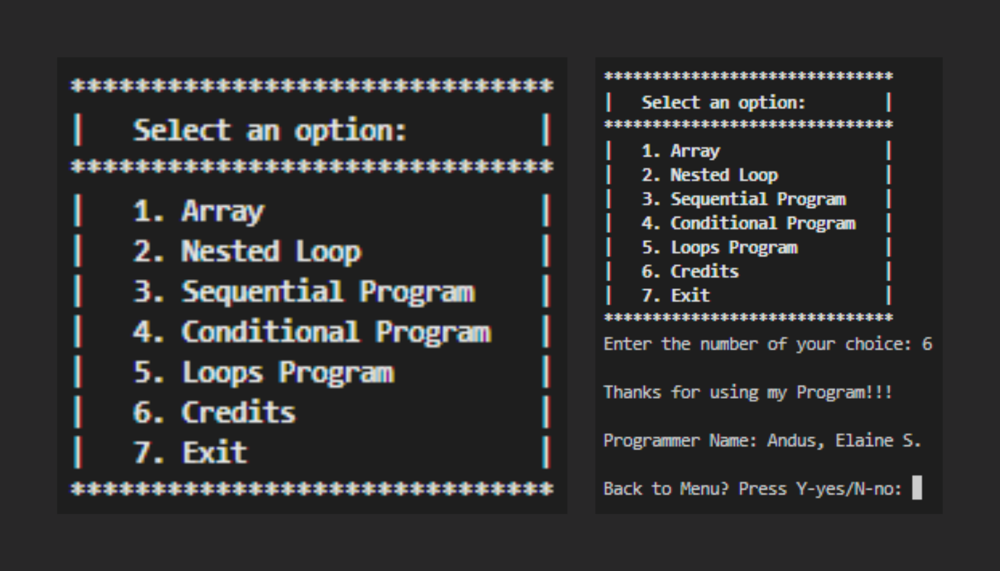

## Python Programming Language (Computer Algorithms)

This is a `Python program` from my subject `CS Professional Elective 2` that displays a menu to the user with different options to choose from. Depending on the user's input, the program will execute a certain function.

### The options presented to the user are:

- `Array:` This option allows the user to input a size for an array and then input that many numbers. The program then prints the even numbers from the array and the sum of all the numbers.

- `Nested Loop:` This option prompts the user to input a number and then displays a pattern of numbers in decreasing order using nested loops.

- `Sequential Program:` This option allows the user to input the radius of a circle, and then calculates and displays the circumference of the circle.

- `Conditional Program:` This option prompts the user to input three numbers and then finds and displays the highest number among the three.

- `Loops Program:` This option prompts the user to input a number and then displays a countdown from that number to 1.

- `Credits:` This option displays the name of the programmer and a thank you message.

- `Exit:` This option exits the program.

The program is structured using a dictionary that maps the options to their respective functions. The `switch()` function displays the menu and waits for user input. The input is used as a key to retrieve the corresponding function from the dictionary, which is then executed. If the user input is not valid, a default function is executed that prompts the user to choose a valid option. The program also allows the user to go back to the menu or exit the program after each function is executed.